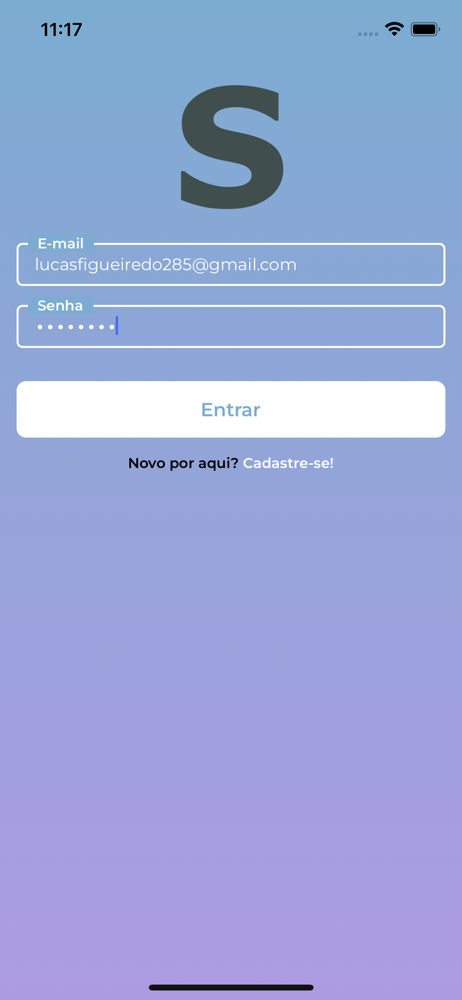
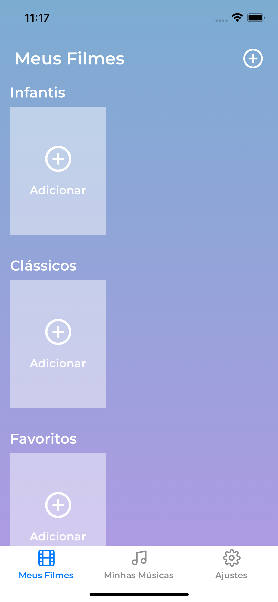
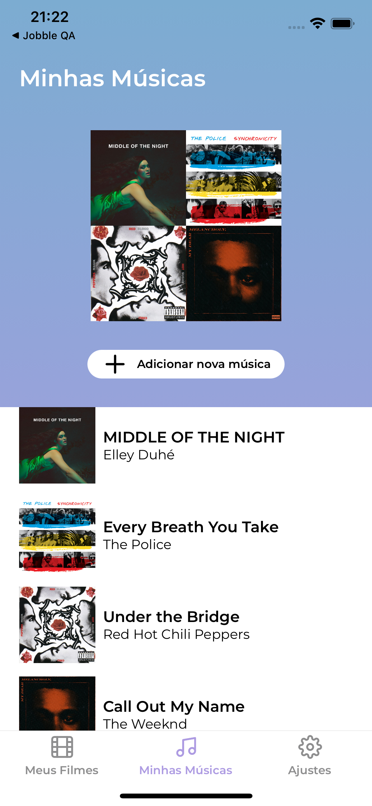

# Spectacle App - React Native

  
  
  

> The goal for developing this project was to be able to wrok with different API providers and multiple firebase services

### Tech Stack

- [x] React Native
- [x] Typescript
- [x] @react-native-firebase/app
- [x] @react-native-firebase/auth
- [x] @react-native-firebase/firestore
- [x] @react-native-firebase/analytics
- [x] @react-native-firebase/crashlytics
- [x] @reduxjs/toolkit
- [x] Spotify API
- [x] react-native-app-auth
- [x] react-native-config (set up .envs)
- [x] TMDB API
- [x] react-i18n-next for supporting internationalization
- [x] Debugging with Flipper

### Fixes and future releases

This project is still under development and next updates will target the following tasks

- [ ] Apply Clean Code principles
- [ ] Add automated tests
- [ ] Create a CI/CD pipeline

## 🛠️ Environment Setup

Follow the setup instructions on [React Native webpage](https://reactnative.dev/docs/environment-setup). Make sure you're setting up the React Native CLI, not the expo

## 🚀 Running the project (Windows and Linux users)

1. Clone the repository on your device, using your preferred method
2. Run `npm install` or `yarn install` to install dependencies
3. Create a new file called `.env.dev` on root directory
4. Copy the content from `.env.example` to `.env.dev`
5. Go to [The Movie Database (TMDB)](https://developers.themoviedb.org/3/getting-started/introduction) to set up an account and create an API Token. Then, copy this token and paste on the `TMDB_TOKEN` environment variable in `.env.dev`
6. Go to [Spotify Developers](https://developer.spotify.com/dashboard/login) to set up an account and create project. Then, copy the spotify client ID into `SPOTIFY_CLIENT_ID` and the spotify client secret into `SPOTIFY_CLIENT_SECRET` environment variables in `.env.dev`
7. Start Metro Bundler by running `yarn start` or `npm run start` on a terminal
8. Run `yarn android` or `npm run android` on a second terminal to run the app

## 🚀 Running the project (macOS users)
1. Run steps 1 to 6 from [Windows users section](#-running-the-project-windows-and-linux-users)
2. Open the ios folder inside of project directory and run `pod install`
3. Run step 7 from [Windows users section](#-running-the-project-windows-and-linux-users)
4. Run `yarn android` or `npm run android` on a second terminal to run the app on an Android device
5. Run `yarn ios` or `npm run ios` on a second terminal to run the app on an iOS device

<!--
## ‼️ Troubleshooting
If the browser don't display the project, check the terminal to see if the project started on a different port. Port 3000 is the default for NextJS applications.
Any other errors, please report an issue
!-->

## 📝 License

This project is under license. See the file [LICENSE](LICENSE.md) for more details.

[⬆ Back to top](#spectacle-app---react-native) 
